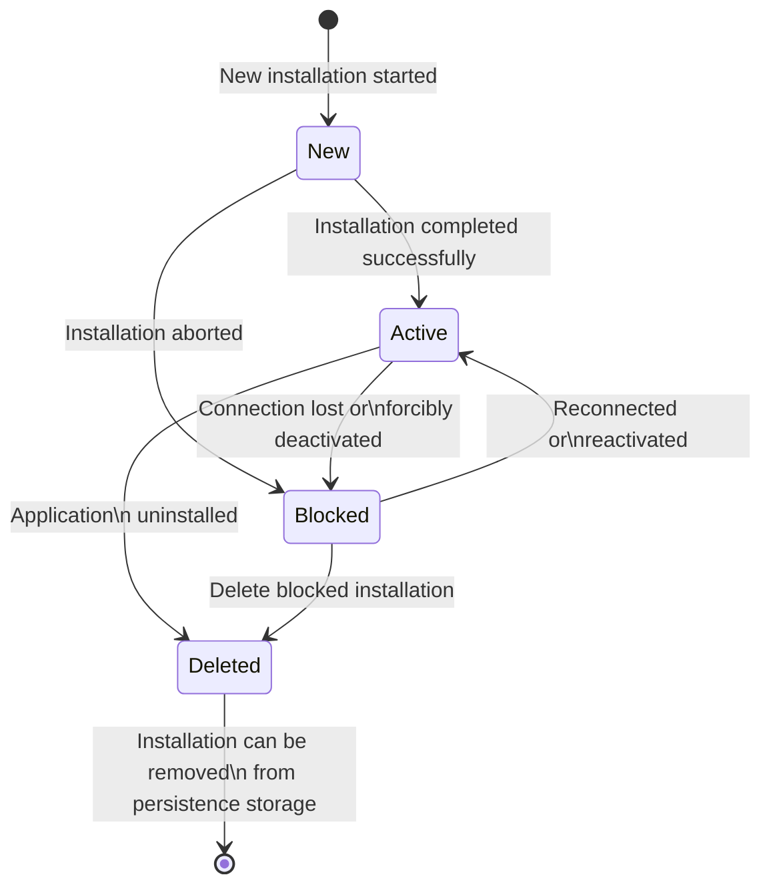
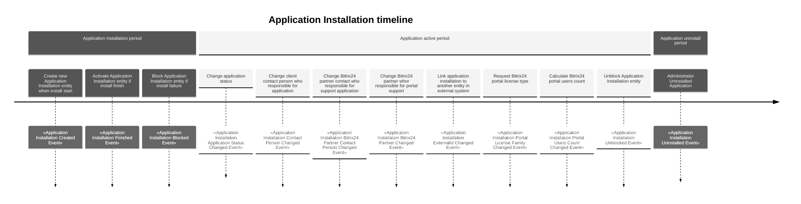

# Application installation entity

Store information about application installation, linked with Bitrix24 Account with auth tokens.
Optional can store links to:

- Client contact person: client person who responsible for application usage
- Bitrix24 Partner contact person: partner contact person who supports client and configure application
- Bitrix24 Partner: partner who supports client portal

| Method                                 | Return Type                     | Description                                                                            | Throws                     |
|----------------------------------------|---------------------------------|----------------------------------------------------------------------------------------|----------------------------|
| `getId()`                              | `Uuid`                          | Returns unique application installation id                                             |                            |
| `getCreatedAt()`                       | `CarbonImmutable`               | Returns date and time application installation was created                             |                            |
| `getUpdatedAt()`                       | `CarbonImmutable`               | Returns date and time of last application installation change                          |                            |
| `getBitrix24AccountId()`               | `Uuid`                          | Returns Bitrix24 Account id related to this installation                               |                            |
| `getContactPersonId()`                 | `?Uuid`                         | Returns contact person id who installed the application on portal (optional)           |                            |
| `changeContactPerson()`                | `void`                          | Changes client contact person                                                          |                            |
| `getBitrix24PartnerContactPersonId()`  | `?Uuid`                         | Returns Bitrix24 partner contact person id (optional)                                  |                            |
| `changeBitrix24PartnerContactPerson()` | `void`                          | Changes Bitrix24 partner contact person                                                |                            |
| `getBitrix24PartnerId()`               | `?Uuid`                         | Returns Bitrix24 Partner id related to this installation (optional)                    |                            |
| `changeBitrix24Partner()`              | `void`                          | Changes Bitrix24 partner                                                               |                            |
| `getExternalId()`                      | `?string`                       | Returns external id for application installation                                       |                            |
| `setExternalId()`                      | `void`                          | Sets external id for application installation                                          | `InvalidArgumentException` |
| `getStatus()`                          | `ApplicationInstallationStatus` | Returns application installation status                                                |                            |
| `applicationInstalled()`               | `void`                          | Finishes application installation                                                      | `InvalidArgumentException` |
| `applicationUninstalled()`             | `void`                          | Marks application as uninstalled                                                       | `InvalidArgumentException` |
| `markAsActive()`                       | `void`                          | Changes status to active for blocked application installation accounts                 | `InvalidArgumentException` |
| `markAsBlocked()`                      | `void`                          | Changes status to blocked for application installation accounts in state new or active | `InvalidArgumentException` |
| `getApplicationStatus()`               | `ApplicationStatus`             | Returns current application status stored in persistence storage                       |                            |
| `changeApplicationStatus()`            | `void`                          | Changes application status                                                             |                            |
| `getPortalLicenseFamily()`             | `PortalLicenseFamily`           | Returns current Bitrix24 tariff plan designation without specified region              |                            |
| `changePortalLicenseFamily()`          | `void`                          | Changes plan designation without specified region                                      |                            |
| `getPortalUsersCount()`                | `?int`                          | Returns Bitrix24 portal users count stored in persistence storage                      |                            |
| `changePortalUsersCount()`             | `void`                          | Changes Bitrix24 portal users count                                                    |                            |
| `getComment()`                         | `?string`                       | Returns comment                                                                        |                            |

## Application installation state diagram

## Repository methods

- `public function save(ApplicationInstallationInterface $applicationInstallation): void;`
    - use case InstallStart
    - use case InstallFinish
    - use case Uninstall
    - use case Activate
    - use case Block
    - use case ChangeContactPerson
    - use case ChangeBitrix24PartnerContactPerson
    - use case ChangeBitrix24Partner
    - use case LinkToExternalEntity
    - use case ChangeApplicationStatus
    - use case ChangePortalLicenseFamily
    - use case ChangePortalUsersCount
- `public function getById(Uuid $uuid): ApplicationInstallationInterface;`
    - use case Activate
    - use case Block
    - use case InstallFinish
    - use case Uninstall
    - use case ChangeContactPerson
    - use case ChangeBitrix24PartnerContactPerson
    - use case ChangeBitrix24Partner
    - use case LinkToExternalEntity
    - use case ChangeApplicationStatus
    - use case ChangePortalLicenseFamily
    - use case ChangePortalUsersCount
- `public function delete(Uuid $uuid): void;`
    - use case Uninstall
- `public function findByBitrix24AccountId(Uuid $uuid): array;`
    - use case InstallFinish
    - use case Uninstall
    - use case ChangeApplicationStatus
    - use case ChangePortalLicenseFamily
    - use case ChangePortalUsersCount
- `public function findByExternalId(string $externalId): array;`
    - use case LinkToExternalEntity

## Events

- `ApplicationInstallationCreatedEvent` – Event triggered when a new installation flow was started
- `ApplicationInstallationFinishedEvent` – Event triggered when application installation flow is finished
- `ApplicationInstallationBlockedEvent` — Event triggered when application installation entity mark as blocked for
  administration or technical reasons e.g. application installation was failed
- `ApplicationInstallationApplicationStatusChangedEvent` — Event triggered when background task check actual application
  status
- `ApplicationInstallationContactPersonChangedEvent` — Event triggered when user in UI or admin changed client contact
  person who responsible for the application
- `ApplicationInstallationBitrix24PartnerContactPersonChangedEvent` — Event triggered when user in UI or admin changed
  bitrix24 partner contact person who responsible for application support
- `ApplicationInstallationBitrix24PartnerChangedEvent` — Event triggered when user in UI or admin changed bitrix24
  partner who responsible for application support
- `ApplicationInstallationExternalIdChangedEvent` – Event triggered when application installation linked with external
  entity in other system
- `ApplicationInstallationPortalLicenseFamilyChangedEvent` – Event triggered when background task check actual
  PortalLicenseFamily
- `ApplicationInstallationPortalUsersCountChangedEvent` – Event triggered when background task check actual users count
- `ApplicationInstallationUnblockedEvent` – Event triggered when application installation entity mark as active
- `ApplicationInstallationUninstalledEvent` — Event triggered when application uninstalled from portal

## Background periodical tasks
- check portal license type
- check application status
- check users count