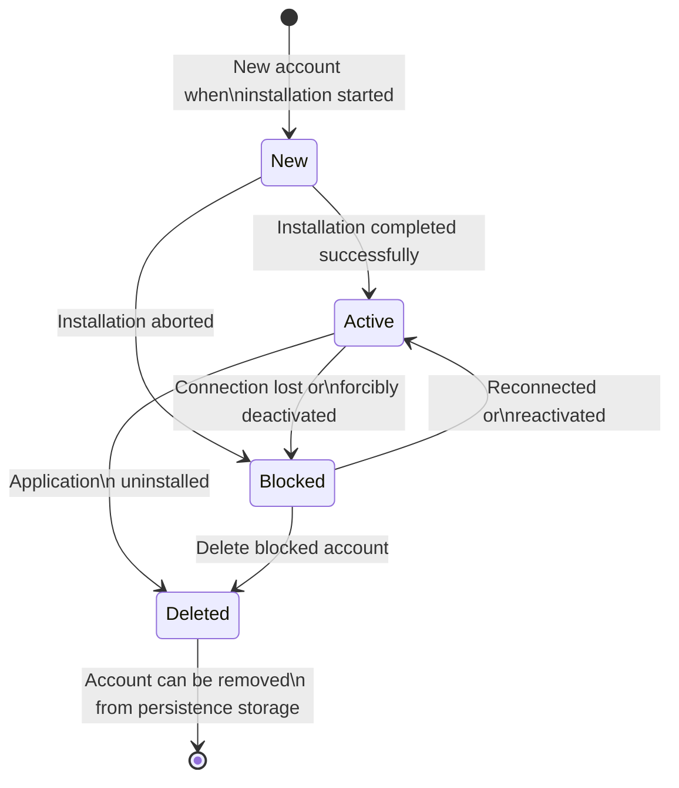
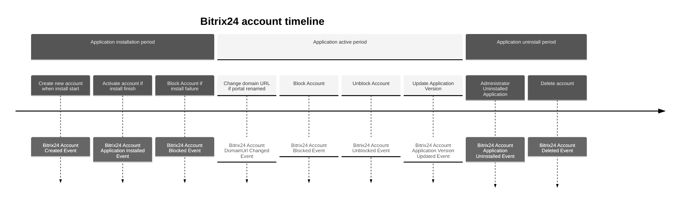

# Bitrix24 account entity

Store auth tokens and provides methods for work with Bitrix24 account.

| Method                       | Return Type             | Description                                                 | Throws                   |
|------------------------------|-------------------------|-------------------------------------------------------------|--------------------------|
| `getId()`                    | `Uuid`                  | Returns the unique account ID.                              | -                        |
| `getBitrix24UserId()`        | `int`                   | Returns the Bitrix24 user ID who installed the application. | -                        |
| `isBitrix24UserAdmin()`      | `bool`                  | Checks if the Bitrix24 user has admin rights.               | -                        |
| `getMemberId()`              | `string`                | Returns the unique portal ID.                               | -                        |
| `getDomainUrl()`             | `string`                | Returns the portal domain URL.                              | -                        |
| `getStatus()`                | `Bitrix24AccountStatus` | Returns the account status.                                 | -                        |
| `getAuthToken()`             | `AuthToken`             | Returns the authentication token.                           | -                        |
| `renewAuthToken()`           | `void`                  | Renews the authentication token.                            | -                        |
| `getApplicationVersion()`    | `int`                   | Returns the application version.                            | -                        |
| `getApplicationScope()`      | `Scope`                 | Returns the application scope (permissions).                | -                        |
| `changeDomainUrl()`          | `void`                  | Changes the domain URL after a portal rename.               | -                        |
| `applicationInstalled()`     | `void`                  | Sets the account status to "active".                        | InvalidArgumentException |
| `applicationUninstalled()`   | `void`                  | Sets the account status to "deleted".                       | InvalidArgumentException |
| `isApplicationTokenValid()`  | `bool`                  | Checks if the provided application token is valid.          | -                        |
| `getCreatedAt()`             | `CarbonImmutable`       | Returns the account creation date and time.                 | -                        |
| `getUpdatedAt()`             | `CarbonImmutable`       | Returns the last account update date and time.              | -                        |
| `updateApplicationVersion()` | `void`                  | Updates the application version.                            | InvalidArgumentException |
| `markAsActive()`             | `void`                  | Changes the account status to active.                       | InvalidArgumentException |
| `markAsBlocked()`            | `void`                  | Changes the account status to blocked.                      | InvalidArgumentException |
| `getComment()`               | `?string`               | Returns the comment for this account.                       | -                        |

## Bitrix24 account state diagram

## Repository methods

- `save(Bitrix24AccountInterface $bitrix24Account): void`
    - use case Activate
    - use case Block
    - use case ChangeDomainUrl
    - use case InstallStart
    - use case InstallFinish
    - use case RenewAuthToken
    - use case Uninstall
    - use case UpdateVersion
- `getById(Uuid $uuid): Bitrix24AccountInterface`
    - use case Activate
    - use case Block
- `delete(Uuid $uuid)`
    - use case Uninstall
- `findByMemberId(string $memberId, ?Bitrix24AccountStatus $status = null, ?bool $isAdmin = null): array`
    - use case InstallStart
    - use case InstallFinish
    - use case RenewAuthToken
    - use case Uninstall
    - use case UpdateVersion (what about multiple accounts???)
- `findByDomain(string $domainUrl, ?Bitrix24AccountStatus $status = null, ?bool $isAdmin = null): array`
    - use case ChangeDomainUrl
- `findOneAdminByMemberId(string $memberId): ?Bitrix24AccountInterface`  

## Events

- `Bitrix24AccountCreatedEvent` — event is triggered when a new Bitrix24 account is created. The account is initially in a `New` state, and the installation process has begun.
- `Bitrix24AccountApplicationInstalledEvent` — event is triggered when an application is successfully installed. It signifies that account finish installation flow.   
- `Bitrix24AccountDomainUrlChangedEvent` — event is triggered when the domain URL associated with a Bitrix24 account is modified.
- `Bitrix24AccountBlockedEvent` — event occurs when a Bitrix24 account is blocked. This could be due to various reasons such as lost auth token, policy violations, or at the request of the account owner.
- `Bitrix24AccountUnblockedEvent` — event is triggered when a previously blocked Bitrix24 account is unblocked and restored to normal functioning. 
- `Bitrix24AccountApplicationVersionUpdatedEvent` — event is triggered when an installed application within a Bitrix24 account is updated to a newer version. It signifies that the application has been successfully upgraded with new features or fixes.  
- `Bitrix24AccountApplicationUninstalledEvent` —  event is triggered when an application uninstalled from a Bitrix24 account.
- `Bitrix24AccountDeletedEvent` — event is triggered when a Bitrix24 account is permanently deleted. This likely represents the final stage in an account's lifecycle and might involve data removal and cleanup processes.
