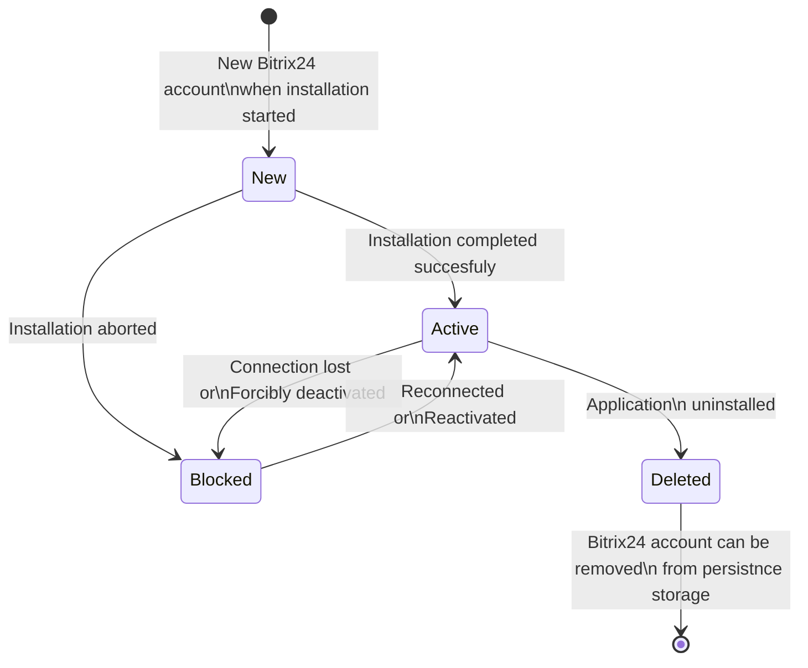

# Bitrix24 account entity

## Bitrix24 account state diagram

## Repository methods

- `save(Bitrix24Accounts\Entity\Bitrix24AccountInterface $bitrix24Account): void`
  - use case Activate
  - use case Block
  - use case ChangeDomainUrl
  - use case InstallStart
  - use case InstallFinish
  - use case RenewAuthToken
  - use case Uninstall
  - use case UpdateVersion
- `getById(Uuid $uuid): Bitrix24Accounts\Entity\Bitrix24AccountInterface` 
  - use case Activate
  - use case Block
- `delete(Bitrix24AccountInterface $entity): void`
  - use case Uninstall
- `findByMemberId(string $memberId, ?Bitrix24AccountStatus $status = null): array`
  - use case InstallStart
  - use case InstallFinish
  - use case RenewAuthToken
  - use case Uninstall
  - use case UpdateVersion (как быть при множественных токенах при обновлении у админа?)
- `findByDomainUrl(string $domainUrl): array`
  - use case ChangeDomainUrl
