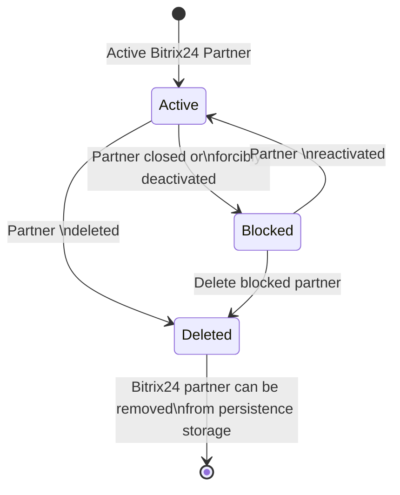
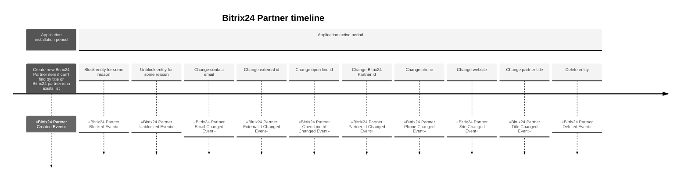

# Bitrix24 Partner entity

Store information about Bitrix24 Partner who supports client portal and install or configure application.

| Method                   | Return Type             | Description                                                            | Throws                     |
|--------------------------|-------------------------|------------------------------------------------------------------------|----------------------------|
| `getId()`                | `Uuid`                  | Returns Bitrix24 partner id                                            |                            |
| `getCreatedAt()`         | `CarbonImmutable`       | Returns date and time Bitrix24 partner was created                     |                            |
| `getUpdatedAt()`         | `CarbonImmutable`       | Returns date and time of last Bitrix24 partner change                  |                            |
| `getExternalId()`        | `?string`               | Returns external id for Bitrix24 partner                               |                            |
| `setExternalId()`        | `void`                  | Sets external id for Bitrix24 partner                                  | `InvalidArgumentException` |
| `getStatus()`            | `Bitrix24PartnerStatus` | Returns Bitrix24 partner status                                        |                            |
| `markAsActive()`         | `void`                  | Changes status to active for blocked Bitrix24 partner accounts         | `InvalidArgumentException` |
| `markAsBlocked()`        | `void`                  | Changes status to blocked for Bitrix24 partner account in active state | `InvalidArgumentException` |
| `markAsDeleted()`        | `void`                  | Changes status to deleted for Bitrix24 partner account (soft delete)   | `InvalidArgumentException` |
| `getComment()`           | `?string`               | Returns comment                                                        |                            |
| `getTitle()`             | `string`                | Returns partner title                                                  |                            |
| `setTitle()`             | `void`                  | Sets partner title                                                     | `InvalidArgumentException` |
| `getSite()`              | `?string`               | Returns partner site                                                   |                            |
| `setSite()`              | `void`                  | Sets partner site                                                      | `InvalidArgumentException` |
| `getPhone()`             | `?PhoneNumber`          | Returns partner phone                                                  |                            |
| `setPhone()`             | `void`                  | Sets partner phone                                                     |                            |
| `getEmail()`             | `?string`               | Returns partner email                                                  |                            |
| `setEmail()`             | `void`                  | Sets partner email                                                     | `InvalidArgumentException` |
| `getBitrix24PartnerId()` | `?int`                  | Returns Bitrix24 partner id                                            |                            |
| `setBitrix24PartnerId()` | `void`                  | Sets Bitrix24 partner id                                               | `InvalidArgumentException` |
| `getOpenLineId()`        | `?string`               | Returns open line id                                                   |                            |
| `setOpenLineId()`        | `void`                  | Sets open line id                                                      | `InvalidArgumentException` |

## Bitrix24 partner state diagram

## Repository methods

- `public function save(Bitrix24PartnerInterface $bitrix24Partner): void;`
    - use case Activate
    - use case Block
    - use case Delete
    - use case SetExternalId
    - use case SetTitle
    - use case SetSite
    - use case SetPhone
    - use case SetEmail
    - use case SetOpenLineId
    - use case SetBitrix24PartnerId
    - use case Create
- `public function delete(Uuid $uuid): void;`
    - use case Delete
- `public function getById(Uuid $uuid): Bitrix24PartnerInterface;`
    - use case Activate
    - use case Block
    - use case Delete
    - use case SetExternalId
    - use case SetTitle
    - use case SetSite
    - use case SetPhone
    - use case SetEmail
    - use case SetBitrix24PartnerId
    - use case SetOpenLineId
- `public function findByBitrix24PartnerId(int $bitrix24PartnerId): ?Bitrix24PartnerInterface;`
    - use case SetBitrix24PartnerId
- `public function findByTitle(string $title): array;`
    - use case Create
    - use case SetSite
- `public function findByExternalId(string $externalId, ?Bitrix24PartnerStatus $bitrix24PartnerStatus = null): array;`
    - use case SetExternalId

## Events

- `Bitrix24PartnerCreatedEvent` – Event triggered when a new Bitrix24 partner was created.
- `Bitrix24PartnerBlockedEvent` – Event triggered when a Bitrix24 partner was blocked for some reason.
- `Bitrix24PartnerUnblockedEvent` – Event triggered when a Bitrix24 partner was unblocked.
- `Bitrix24PartnerEmailChangedEvent` – Event triggered when a Bitrix24 partner email was changed.
- `Bitrix24PartnerExternalIdChangedEvent` – Event triggered when a Bitrix24 partner external id was changed.
- `Bitrix24PartnerOpenLineIdChangedEvent` – Event triggered when a Bitrix24 partner open line id was changed.
- `Bitrix24PartnerPartnerIdChangedEvent` – Event triggered when a Bitrix24 partner id was changed.
- `Bitrix24PartnerPhoneChangedEvent` – Event triggered when a Bitrix24 partner phone was changed.
- `Bitrix24PartnerSiteChangedEvent` – Event triggered when a Bitrix24 partner site was changed.
- `Bitrix24PartnerTitleChangedEvent` – Event triggered when a Bitrix24 partner title was changed.
- `Bitrix24PartnerDeletedEvent` – Event triggered when a Bitrix24 partner deleted.

