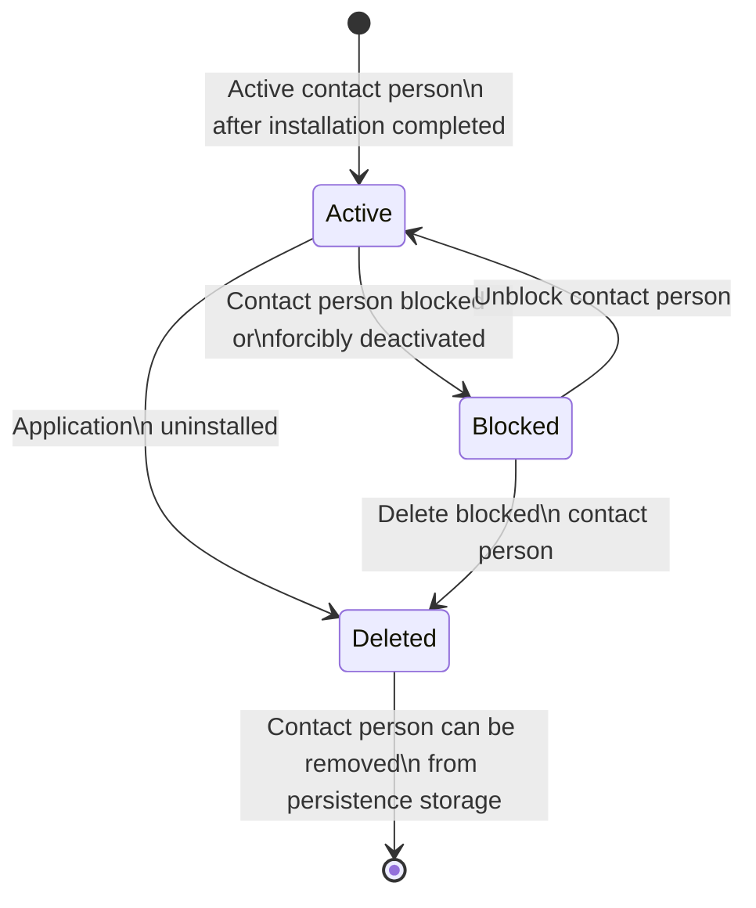
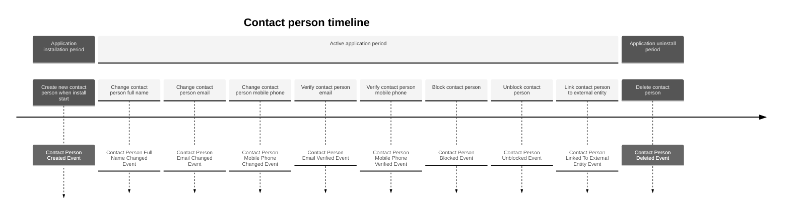

# Contact Person entity

Store information about person who installed application

| Method                        | Return Type           | Description                                                                 | Throws                     |
|-------------------------------|-----------------------|-----------------------------------------------------------------------------|----------------------------|
| `getId()`                     | `Uuid`                | Returns unique contact person id                                            | -                          |
| `getStatus()`                 | `ContactPersonStatus` | Returns contact person status                                               | -                          |
| `markAsActive()`              | `void`                | Sets contact person status to active                                        | `InvalidArgumentException` |
| `markAsBlocked()`             | `void`                | Sets contact person status to blocked                                       | `InvalidArgumentException` |
| `markAsDeleted()`             | `void`                | Sets contact person status to deleted (soft delete)                         | `InvalidArgumentException` |
| `getFullName()`               | `FullName`            | Returns contact person full name                                            | -                          |
| `changeFullName()`            | `void`                | Changes contact person full name                                            | -                          |
| `getCreatedAt()`              | `CarbonImmutable`     | Returns date and time contact person was created                            | -                          |
| `getUpdatedAt()`              | `CarbonImmutable`     | Returns date and time contact person was last updated                       | -                          |
| `getEmail()`                  | `?string`             | Returns contact person email (if any)                                       | -                          |
| `changeEmail()`               | `void`                | Changes contact person email                                                | -                          |
| `markEmailAsVerified()`       | `void`                | Marks contact person email as verified                                      | -                          |
| `getEmailVerifiedAt()`        | `?CarbonImmutable`    | Returns date and time email was verified (if verified)                      | -                          |
| `changeMobilePhone()`         | `void`                | Changes mobile phone for contact person                                     | -                          |
| `getMobilePhone()`            | `?PhoneNumber`        | Returns contact person mobile phone (if any)                                | -                          |
| `getMobilePhoneVerifiedAt()`  | `?CarbonImmutable`    | Returns date and time mobile phone was verified (if verified)               | -                          |
| `markMobilePhoneAsVerified()` | `void`                | Marks contact person mobile phone as verified                               | -                          |
| `getComment()`                | `?string`             | Returns comment for this contact person (if any)                            | -                          |
| `setExternalId()`             | `void`                | Sets external id for contact person from external system                    | -                          |
| `getExternalId()`             | `?string`             | Returns external id for contact person (if any)                             | -                          |
| `getBitrix24UserId()`         | `?int`                | Returns bitrix24 user id if contact person mapped on bitrix24 user (if any) | -                          |
| `getBitrix24PartnerId()`      | `?Uuid`               | Returns bitrix24 partner id if contact person is bitrix24 partner employee  | -                          |
| `setBitrix24PartnerId()`      | `void`                | Change bitrix24 partner id if contact person is bitrix24 partner employee   | -                          |
| `getUserAgent()`              | `?string`             | Returns user agent for contact person                                       | -                          |
| `getUserAgentReferer()`       | `?string`             | Returns user agent referer for contact person                               | -                          |
| `getUserAgentIp()`            | `?IP`                 | Returns user agent IP for contact person                                    | -                          |

## Contact person state diagram

## Repository methods

- `public function save(ContactPersonInterface $contactPerson): void;`
    - use case Create
    - use case Block
    - use case Unblock
    - use case ChangeFullName
    - use case ChangeEmail
    - use case ChangeMobilePhone
    - use case VerifyEmail
    - use case VerifyMobilePhone
    - use case AddComment
    - use case LinkToExternalEntity
    - use case LinkToBitrix24Partner
    - use case UnlinkFromBitrix24Partner
- `public function delete(Uuid $uuid): void;`
    - use case Delete
- `public function getById(Uuid $uuid): ContactPersonInterface;`
    - use case Block
    - use case Unblock
    - use case ChangeFullName
    - use case ChangeEmail
    - use case ChangeMobilePhone
    - use case VerifyEmail
    - use case VerifyMobilePhone
    - use case AddComment
    - use case LinkToExternalEntity
- `public function findByEmail(string $email, ?ContactPersonStatus $contactPersonStatus = null, ?bool $isEmailVerified = null): array;`
    - use case ChangeEmail
    - use case VerifyEmail
- `public function findByPhone(PhoneNumber $phoneNumber, ?ContactPersonStatus $contactPersonStatus = null, ?bool $isPhoneVerified = null): array;`
    - use case ChangeMobilePhone
    - use case VerifyMobilePhone
- `public function findByExternalId(string $externalId, ?ContactPersonStatus $contactPersonStatus = null): array;`
    - use case LinkToExternalEntity

## Events

